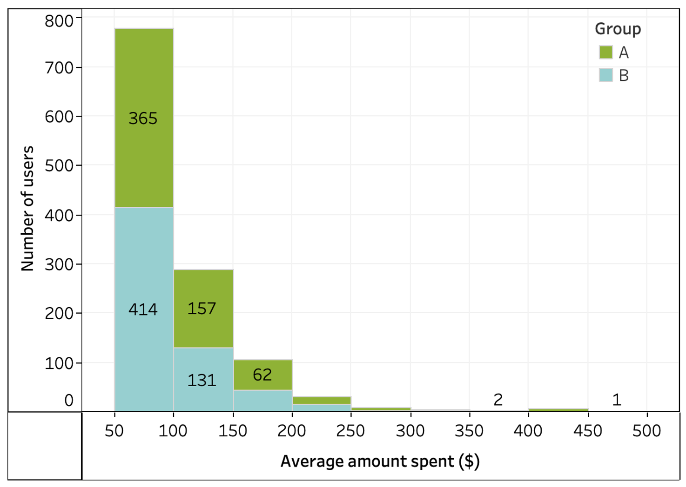
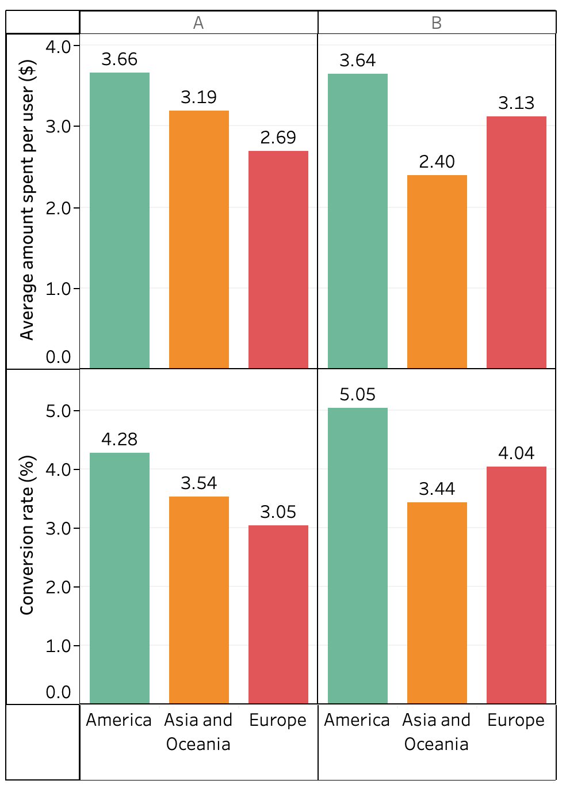
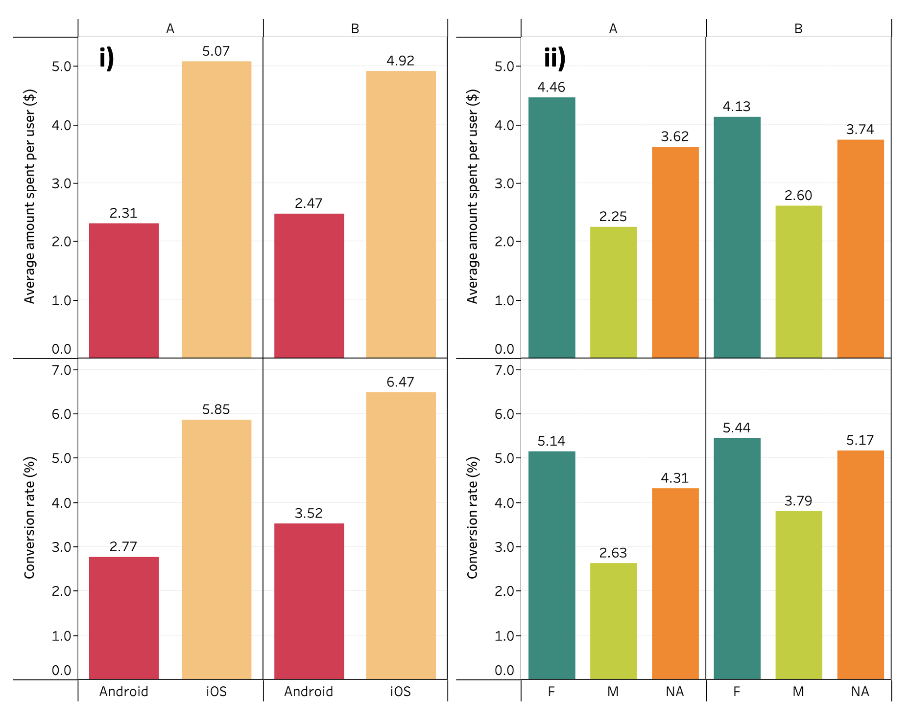
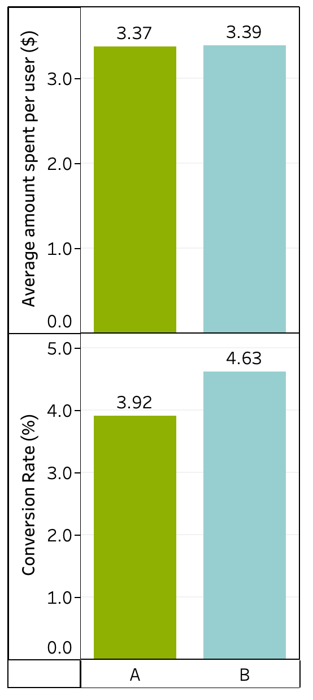
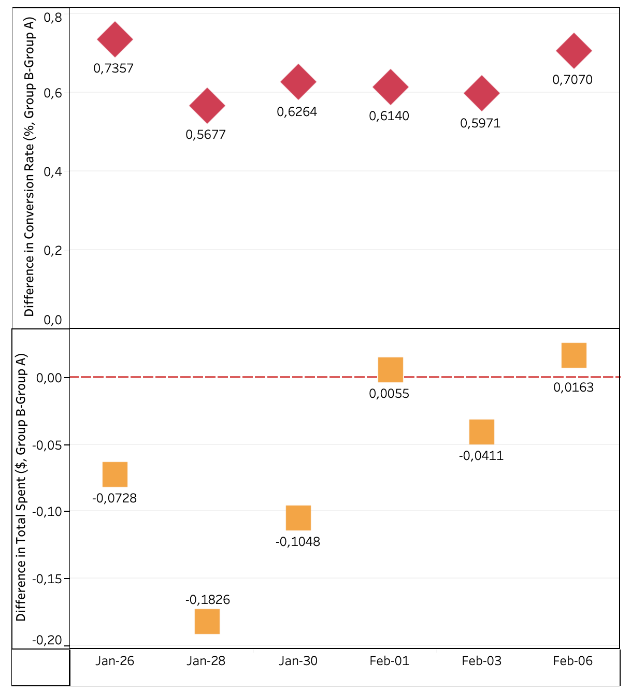

# A/B Test Report: Food and Drink Banner

## Purpose

The purpose of this A/B test is to analyze whether GloBox should launch a new Food and Drink Banner in its app for all mobile users.

## Hypotheses

**Null hypothesis:**

1. There is no difference in conversion rate between the control (existing landing page) and treatment group (include food and drink banner).

2. There is no difference in average amount spent per user between the control (existing landing page) and treatment group (include food and drink banner).

**Alternative hypothesis:**

1. A difference exists in conversion rate between the control and treatment groups.
2. A difference exists in average amount spent per user between the control and treatment groups.

## Methodology

### Test Design

| | Population| Control Group (A) |Test Group (B)|
|----------|----------|----------|----------|
| | All of the possible users for the GloBox app   | Mobile users using the existing landing page|Mobile users using new landing page with food and drink banner|
|Number of users| -   | 24,343   |24,600|

 **Duration:** January 25, 2023, to February 6, 2023.

**Success Metrics:** Conversion rate (%) and average amount spent per user ($).

### Data Analysis

#### Pre-Processing Steps

1. Created 3 temporary tables for incorporation into a comprehensive analysis table:
   - **First table:** Aggregated the activity table by user.
   - **Second table:** Joined three tables using a left join on the user ID.
   - **Third table:** Handled null values and added a binary conversion column.

2. Selected all data from the third table.

3. Downloaded the final table as a CSV file.

4. Used the CSV file in Tableau and Excel for:
   - Visualization.
   - Hypothesis testing.
   - Confidence interval determination.

```sql
WITH activity_agg AS(
SELECT 
  uid, 
  SUM(spent) AS total_spent
FROM activity
GROUP BY uid
),

joined_tables AS(
  SELECT *
  FROM users u
  LEFT JOIN groups g ON u.id = g.uid
  LEFT JOIN activity_agg a ON u.id=a.uid
), 
conversion_table AS(
  SELECT 
    id, 
    COALESCE(country,'NA') AS country,
    COALESCE(gender,'NA') AS gender,
    "group",
    join_dt,
    COALESCE(device,'NA') AS device,
    COALESCE(total_spent,0) AS total_spent, 
    CASE
	    WHEN total_spent > 0 THEN 1
      ELSE 0
    END AS conversion_01
  FROM joined_tables
)

SELECT * 
FROM conversion_table;
```

#### Statistical Analysis

The statistical tests used for the two success metrics are listed below.

**Conversion Rate**

- Hypothesis testing: Two-sample z-test with pooled proportion
- Confidence Interval: Two-sample z-interval with unpooled proportions

**Average Amount Spent**

- Hypothesis testing: Two-sample t-test with unpooled variance
- Confidence Interval: Two-sample t-interval with unpooled variance

## Results

### Exploratory Data Analysis

The exploratory data analysis (EDA) provides a visual summary of the average amount spent per user and insights into spending patterns by region, device type, and gender.

#### Distribution of the Average Amount Spent per User

The distribution of the average amount spent per user (Figure 1) is right-skewed, indicating that while most users spend relatively small amounts, a few spend significantly more. Users who spent \$0 and those who spent more than \$450 are excluded to improve visualization clarity. This pattern suggests that our marketing strategies should focus on both attracting new users and encouraging high-spending users to spend more.

<div style="text-align: center;">
  <figure>
    
    <figcaption>Figure 1: Average amount spent per user and conversion rate by i) device type and ii) gender.</figcaption>
  </figure>
</div>

#### Average Amount Spent per User and Conversion Rate by Region, Device and Gender

When examining spending patterns by region, notable variations are observed. Grouping continents with smaller sample fractions (Asia and Oceania) reveals that America demonstrates the highest average spending and conversion rate across all regions and both groups (Figure 2).

<div style="text-align: center;">
  <figure>
    
    <figcaption>Figure 2: Average amount spent per user and conversion rate by region.</figcaption>
  </figure>
</div>

The analysis broken down by device type and gender reveals that iOS users have higher average spending and conversion rates than Android users, despite Android users representing about 60% of the test population (Figure 4). Additionally, female users show higher conversion rates and average spending per user compared to their male counterparts. These insights can inform more personalized user engagement strategies.

<div style="text-align: center;">
  <figure>
    
    <figcaption>Figure 3: Average amount spent per user and conversion rate by i) device type and ii) gender.</figcaption>
  </figure>
</div>

Overall, the EDA uncovers significant patterns and disparities in user spending and engagement across different segments. These insights are crucial for refining marketing strategies and improving targeting to maximize the impact of the Food and Drink Banner on user engagement and revenue. Sharing these findings aims to keep stakeholders informed and involved in the data analysis process.

#### Results Overview
Conversion rate increased significantly for the treatment group compared to the control group (4.63% vs. 3.92%).

Average amount spent per user did not show a significant difference between the control and treatment groups (\$3.39 vs \$3.37).

<div style="text-align: center;">
  <figure>
    
    <figcaption>Figure 4: Average amount spent per user ($) and conversion rate (%) for the control (A) and test (B) groups.</figcaption>
  </figure>
</div>

### Interpretation
#### Outcome of the Tests
For conversion rate at the 5% significance level, there is sufficient evidence to reject the null hypothesis.

Based on our analysis, we are 95% confident that the true difference in conversion rate (treatment-control) between Group A and Group B lies between **0.35%** and **1.06%**.

Regarding the average amount spent, at the 5% significance level, there is insufficient evidence to reject the null hypothesis.

Based on our analysis, we are 95% confident that the true difference in average amount spent (treatment-control) between Group A and Group B lies between **-\$0.4386** and **\$0.4713**.

#### Statistical power analysis

For the conversion rate metric, with a statistical power of 0.8 and a significance level of 0.05, our analysis indicates a total sample size requirement of **77,000** to detect the minimum effect size.

Similarly, for the average amount spent metric, our analysis suggests a total sample size requirement of **7,792,602** to achieve a statistical power of 0.8 at a significance level of 0.05, assuming an equal split among groups.

#### Novelty effect

The novelty effect was evaluated by splitting the entire duration of the A/B test into six segments and calculating the differences between both groups for both metrics to identify any trends in the data.

<div style="text-align: center;">
  <figure>
    
    <figcaption>Figure 5: Difference between the test and control group in terms of the average amount spent per user ($) and conversion rate (%) over the test duration.</figcaption>
  </figure>
</div>

**Conversion Rate:**
Maintained relatively stable values throughout the test, ranging from 0.57% to 0.74%. This suggests that the conversion rate was not significantly affected by the novelty of the changes introduced in the test.

**Average Amount Spent:**
Showed fluctuation in the data but displayed an increasing trend, with values ranging from -\$0.18 to \$0.02. The increasing trend in average amount spent suggests that while the conversion rate remained stable, users engaged more deeply with the platform over time.

## Conclusions

#### Key Takeaways

The experiment demonstrated a statistically significant increase in the conversion rate for the treatment group compared to the control group, indicating the effectiveness of the banner in driving user engagement.

Although the average amount spent per user did not show a significant difference between the groups, it exhibited an increasing trend over the duration of the experiment, suggesting potential for further optimization and revenue growth.

Segmentation analysis revealed differences in response to the experiment based on user attributes such as demographics, gender, and device type, highlighting opportunities for targeted marketing strategies and personalized user experiences.

#### Limitations/Considerations

*Selection Bias:*
The experiment may have been affected by selection bias if there were inherent differences between the control and treatment groups that influenced their response to the banner. Conducting randomization checks and adjusting for confounding variables can help mitigate this bias.  

*External Factors:*
External factors such as seasonality, marketing campaigns, or changes in user behavior outside the experiment's control may have influenced the results. Conducting sensitivity analysis and controlling for external variables can help identify and account for these factors.

## Recommendations

Based on the statistically significant increase in conversion rate observed in the treatment group, **the Food and Drink Banner experiment should be launched**. The recommendation to launch the banner was based on the following aspects.

*Statistical Criteria:*
We observed a statistically significant increase in the conversion rate metric, which suggests that the banner may have a positive impact on user engagement and actions taken on the platform. Although the average amount spent per user did not show a statistically significant difference, it is noteworthy that the difference in the average amount spent appears to show an increasing trend as the test progressed, indicating a potential for improvement over time.

*Business Factors Considered:*
The perceived cost of launching and maintaining the banner is relatively low, making it a feasible investment even if only one success metric, in this case, the conversion rate, shows a significant increase. Additionally, the potential benefits of improving user engagement and driving conversions could outweigh the operational costs.

*Impact to User Experience:*
Given that the banner occupies prime real estate on the main page, it's crucial to ensure that its implementation leads to a substantial improvement in revenue per user. While the conversion rate improvement suggests a positive impact on user engagement, further monitoring and optimization may be necessary to ensure a seamless and beneficial user experience.

In summary, launching the experiment aligns with our goals of enhancing user engagement and potentially driving revenue growth. Continuous monitoring and iteration will be essential to maximize the effectiveness of the banner feature and optimize its impact on user experience and business outcomes.

#### Further Analysis

*Customer Journey Analysis:*
Mapping out the customer journey from initial interaction with the banner to conversion or exit can provide valuable insights into user behavior and potential friction points in the conversion funnel. Understanding the different touchpoints and interactions users have with the banner can help optimize its placement, messaging, and design.

*A/B/C Testing:*
Consider conducting follow-up A/B/C tests to test variations of the banner design, messaging, or placement to further optimize performance. Testing multiple variations simultaneously can help identify the most effective elements and refine the experiment iteratively.

*Qualitative Feedback Collection:*
Supplement quantitative analysis with qualitative feedback from users through surveys, interviews, or usability testing. Understanding user perceptions, preferences, and pain points can provide deeper insights into the effectiveness of the experiment and inform iterative improvements.
